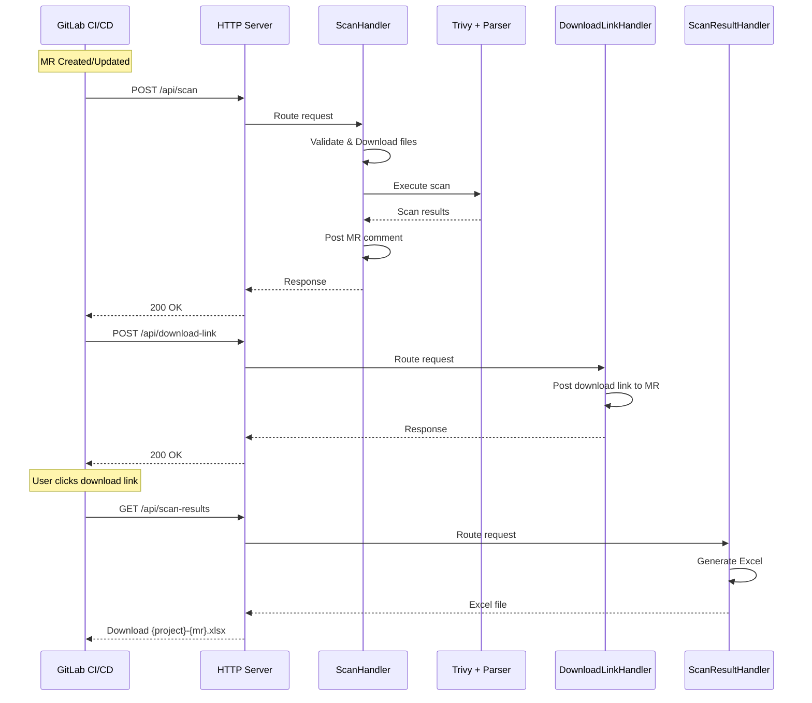
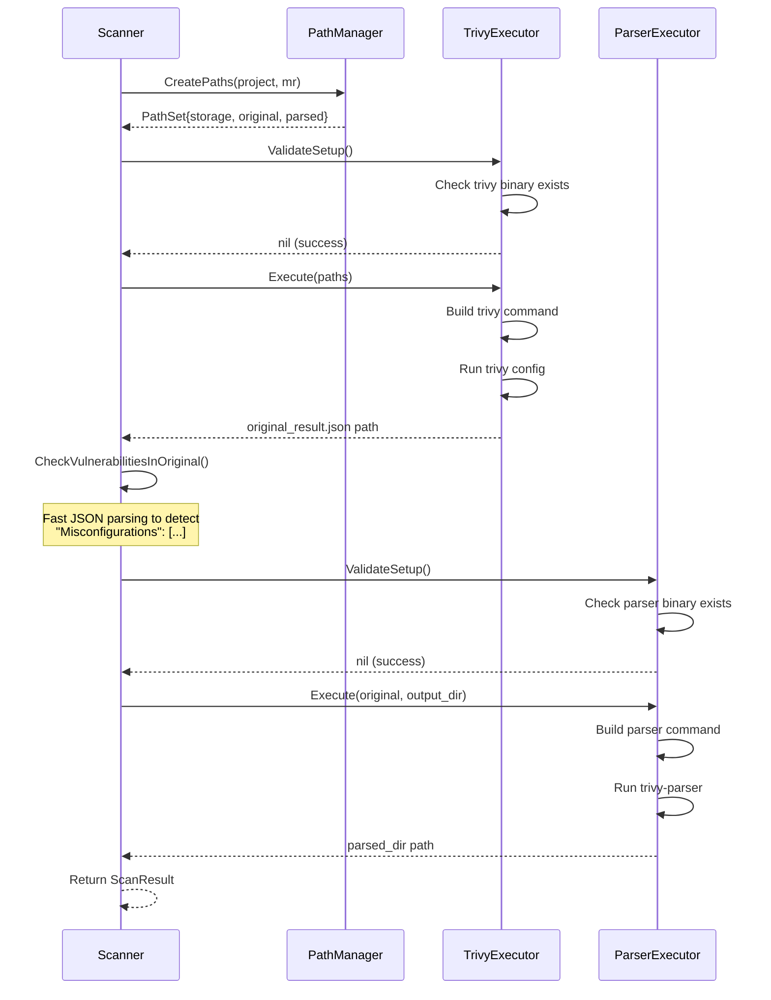

# Sequence Diagrams

## Simple Workflow

```mermaid
sequenceDiagram
    participant CI as GitLab CI/CD
    participant Server as HTTP Server
    participant ScanHandler as ScanHandler
    participant Binaries as Trivy + Parser
    participant LinkHandler as DownloadLinkHandler
    participant ResultHandler as ScanResultHandler

    Note over CI: MR Created/Updated
    CI->>Server: POST /api/scan
    Server->>ScanHandler: Route request
    
    ScanHandler->>ScanHandler: Validate & Download files
    ScanHandler->>Binaries: Execute scan
    Binaries-->>ScanHandler: Scan results
    ScanHandler->>ScanHandler: Post MR comment
    ScanHandler-->>Server: Response
    Server-->>CI: 200 OK
    
    CI->>Server: POST /api/download-link
    Server->>LinkHandler: Route request
    LinkHandler->>LinkHandler: Post download link to MR
    LinkHandler-->>Server: Response
    Server-->>CI: 200 OK
    
    Note over CI: User clicks download link
    CI->>Server: GET /api/scan-results
    Server->>ResultHandler: Route request
    ResultHandler->>ResultHandler: Generate Excel
    ResultHandler-->>Server: Excel file
    Server-->>CI: Download {project}-{mr}.xlsx
```

## Scanner Internal Flow

```mermaid
sequenceDiagram
    participant S as Scanner
    participant PM as PathManager
    participant TE as TrivyExecutor
    participant PE as ParserExecutor

    S->>PM: CreatePaths(project, mr)
    PM-->>S: PathSet{storage, original, parsed}
    
    S->>TE: ValidateSetup()
    TE->>TE: Check trivy binary exists
    TE-->>S: nil (success)
    
    S->>TE: Execute(paths)
    TE->>TE: Build trivy command
    TE->>TE: Run trivy config
    TE-->>S: original_result.json path
    
    S->>S: CheckVulnerabilitiesInOriginal()
    Note over S: Fast JSON parsing to detect<br/>"Misconfigurations": [...]
    
    S->>PE: ValidateSetup()
    PE->>PE: Check parser binary exists
    PE-->>S: nil (success)
    
    S->>PE: Execute(original, output_dir)
    PE->>PE: Build parser command
    PE->>PE: Run trivy-parser
    PE-->>S: parsed_dir path
    
    S-->>S: Return ScanResult
```
