# Sequence Diagrams

## 1. Complete Scan Workflow

```mermaid
sequenceDiagram
    participant CI as GitLab CI/CD
    participant API as HTTP Server
    participant Handler as ScanHandler
    participant GitLab as GitLab API
    participant Scanner as Scanner
    participant Trivy as Trivy Binary
    participant Parser as trivy-parser
    participant Report as Report Builder
    participant FS as File System

    Note over CI: Merge Request Created/Updated
    CI->>API: POST /api/scan
    Note over CI,API: Headers:<br/>X-API-Secret: {secret}<br/>Content-Type: application/json
    
    API->>Handler: Route to ScanHandler
    
    rect rgb(240, 240, 240)
        Note over Handler: 1. Request Validation
        Handler->>Handler: Validate API Secret
        alt Invalid Secret
            Handler-->>CI: 401 Unauthorized
        end
        Handler->>Handler: Parse JSON Body
        alt Invalid JSON
            Handler-->>CI: 400 Bad Request
        end
    end
    
    rect rgb(230, 245, 255)
        Note over Handler,GitLab: 2. File Download
        loop For each file path
            Handler->>GitLab: GET /api/v4/projects/{id}/repository/files/{path}/raw
            Note over Handler,GitLab: Ref: {source_branch}
            GitLab-->>Handler: File Content (bytes)
            Handler->>FS: Save to storage/{project-id}/mr-{mr-iid}/{file}
        end
    end
    
    rect rgb(255, 245, 230)
        Note over Handler,Parser: 3. Security Scan
        Handler->>Scanner: Scan(ScanRequest)
        
        Scanner->>Scanner: ValidateSetup()
        Note over Scanner: Check trivy & parser binaries
        
        Scanner->>FS: Create scan-results/original/
        Scanner->>Trivy: Execute trivy config
        Note over Scanner,Trivy: Command:<br/>trivy config<br/>--config-policy ./custom-policies<br/>--format json<br/>--output {result.json}<br/>{storage-path}
        
        Trivy->>FS: Scan Terraform files
        Trivy->>FS: Write scan-results/original/{project}-{mr}.json
        Trivy-->>Scanner: Exit Code 0
        
        Scanner->>Scanner: CheckVulnerabilitiesInOriginal()
        Note over Scanner: Parse JSON to detect<br/>"Misconfigurations": [...]
        
        Scanner->>Parser: Execute trivy-parser
        Note over Scanner,Parser: Command:<br/>trivy-parser<br/>-input {original.json}<br/>-output {scan-results}/{project}/mr-{mr}/<br/>-preprocess -pretty
        
        Parser->>FS: Read original scan result
        Parser->>Parser: Group by policy ID
        Parser->>Parser: Split by target (.tf file)
        Parser->>Parser: Separate builtin vs custom
        Parser->>FS: Write builtin-{file}.json
        Parser->>FS: Write custom-{file}.json
        Parser->>FS: Write summary.xlsx
        Parser-->>Scanner: Exit Code 0
        
        Scanner-->>Handler: ScanResult{<br/>  ParserSuccess: true,<br/>  HasVulnerabilities: true,<br/>  ParsedDir: "..."<br/>}
    end
    
    rect rgb(240, 255, 240)
        Note over Handler,GitLab: 4. MR Feedback
        alt ScanResult != nil
            Handler->>Report: BuildComment(ScanResult)
            
            alt HasVulnerabilities == true
                Report->>FS: Read scan-results/{project}/mr-{mr}/*.json
                Report->>Report: Parse severity summaries
                Report->>Report: Build Markdown with violations
                Report-->>Handler: Detailed comment with findings
            else No vulnerabilities
                Report-->>Handler: Success message
            end
            
            Handler->>GitLab: POST /api/v4/projects/{id}/merge_requests/{iid}/notes
            Note over Handler,GitLab: Body: {body: markdown_comment}
            GitLab-->>Handler: 201 Created
        else Scan failed
            Handler->>GitLab: POST /api/v4/projects/{id}/merge_requests/{iid}/notes
            Note over Handler,GitLab: Body: "⚠️ 보안 스캔을 수행할 수 없습니다.<br/>관리자에게 문의해주세요."
        end
    end
    
    rect rgb(255, 240, 240)
        Note over Handler,FS: 5. Cleanup
        Handler->>FS: Remove storage/{project-id}/mr-{mr-iid}/
        Handler->>FS: Remove storage/{project-id}/ (if empty)
    end
    
    Handler-->>API: HTTP 200 OK
    API-->>CI: JSON Response
    Note over API,CI: {<br/>  "status": "completed",<br/>  "files_success": N,<br/>  "files_failed": 0<br/>}
```



## 2. Download Link Workflow


## 3. Scan Results Download Workflow

```mermaid
sequenceDiagram
    participant User as Developer/Reviewer
    participant Browser as Web Browser
    participant API as HTTP Server
    participant Handler as ScanResultsHandler
    participant Excel as Excel Builder
    participant FS as File System

    Note over User: Clicks download link in MR comment
    User->>Browser: Click Download Link
    Browser->>API: GET /api/scan-results?project={path}&mr={iid}
    Note over Browser,API: Headers:<br/>X-API-Secret: {secret}
    
    API->>Handler: Route to ScanResultsHandler
    
    Handler->>Handler: Validate API Secret
    alt Invalid Secret
        Handler-->>Browser: 401 Unauthorized
    end
    
    Handler->>Handler: Parse query parameters
    alt Missing parameters
        Handler-->>Browser: 400 Bad Request
    end
    
    Handler->>FS: Check scan-results/{project}/mr-{mr}/
    alt Directory not found
        Handler-->>Browser: 404 Not Found
    end
    
    Handler->>Excel: BuildExcelFromResults(result_dir)
    
    Excel->>FS: Read builtin-*.json files
    Excel->>FS: Read custom-*.json files
    
    Excel->>Excel: Parse scan results
    Excel->>Excel: Create XLSX with 2 sheets
    Note over Excel: Sheets:<br/>- Custom Policies<br/>- Built-in Policies
    
    Excel->>Excel: Add columns:<br/>Target, Title, Resource,<br/>Severity, Resolution,<br/>StartLine, EndLine, URL
    
    Excel->>Excel: Apply styling:<br/>- Header: bold + yellow<br/>- CRITICAL/HIGH: red text
    
    Excel-->>Handler: Excel file (bytes)
    
    Handler-->>Browser: HTTP 200 OK
    Note over Handler,Browser: Headers:<br/>Content-Type: application/vnd...sheet<br/>Content-Disposition: attachment;<br/>  filename="{project}-{mr}-results.xlsx"
    
    Browser->>User: Download {project}-{mr}-results.xlsx
```

## 4. Error Handling Scenarios


## Key Components Interaction

### Scanner Internal Flow


### Report Builder Internal Flow


## Notes

- **Asynchronous operations**: File downloads happen sequentially, not in parallel
- **Error resilience**: Partial failures are tracked and reported, not fatal
- **Cleanup strategy**: Temporary files removed regardless of scan success/failure
- **GitLab API rate limiting**: Not currently handled, may need retry logic for production
- **Scanner validation**: Pre-flight checks prevent runtime errors from missing binaries
